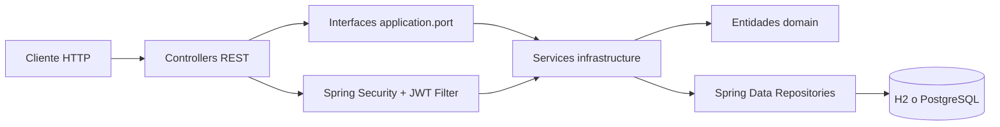
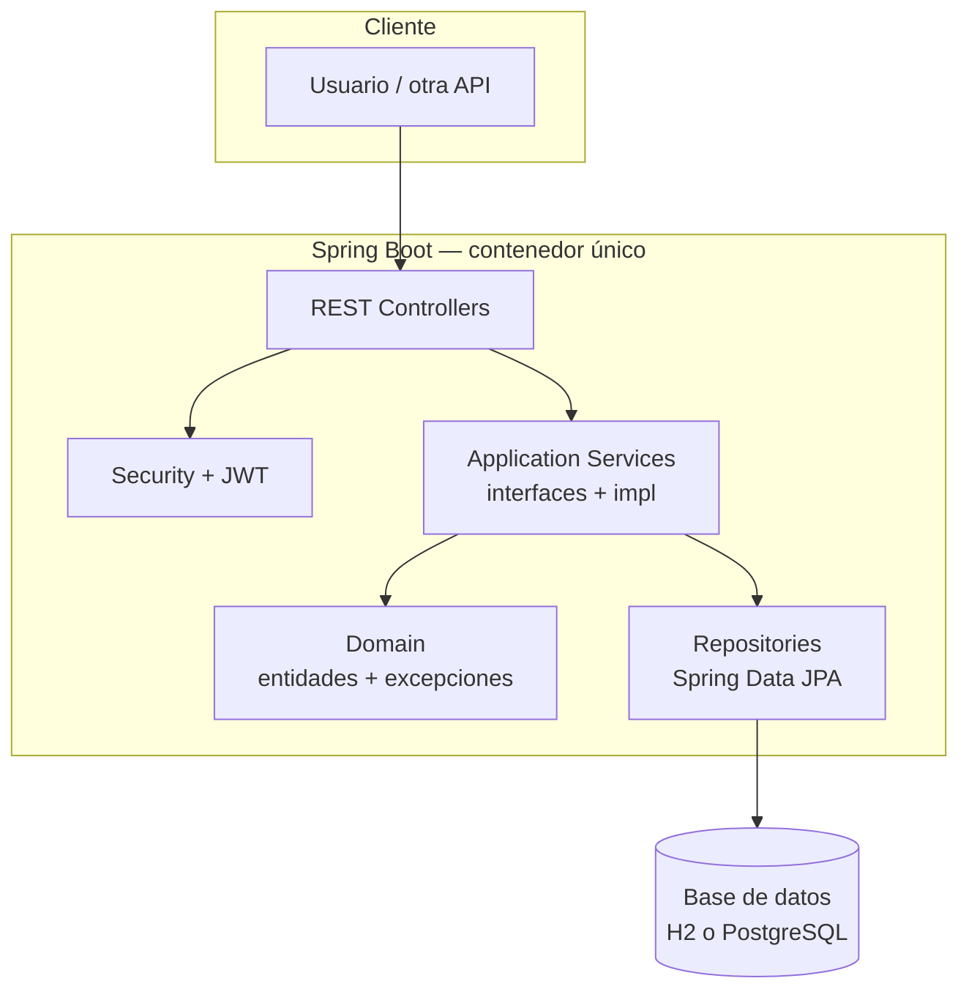
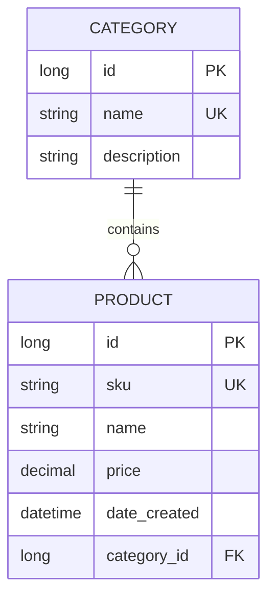

# Documentación técnica y arquitectónica — Proyecto Catálogo (`catalog-demo`)

**Alcance del análisis:** el repositorio actual contiene principalmente el módulo **`catalog-demo`**, una API REST en **Spring Boot 3.2.5** (Java 17). El histórico **Shopizer** original aparece eliminado o ausente en el árbol de trabajo analizado; **no existe código frontend** (SPA, móvil ni plantillas servidor) dentro de este proyecto: el “cliente” es cualquier consumidor HTTP (navegador, Postman, otro backend).

**Metodología:** revisión estática del código fuente, configuración Maven, YAML, Docker y pruebas unitarias/integración ligeras.

---

# 1. Visión General del Proyecto

## 1.1 Propósito

El proyecto implementa un **backend de catálogo de productos** con **categorías**, operaciones **CRUD**, **búsqueda paginada**, **autenticación JWT** y **documentación OpenAPI (Swagger UI)**. Está pensado como **demo académica** de buenas prácticas de capas, validación, seguridad y despliegue con **H2** (local) o **PostgreSQL** (Docker).

## 1.2 Problema que resuelve

- Centralizar la gestión de **productos** (SKU único, precio, nombre, categoría obligatoria).
- Centralizar la gestión de **categorías** (nombre único) con regla de negocio: **no eliminar categoría con productos asociados**.
- Exponer una **API versionada** (`/api/v1/...`) consumible por frontends o integraciones.
- Proteger operaciones de escritura con **JWT** mientras la lectura del catálogo permanece pública.

## 1.3 Tecnologías

| Tecnología | Uso en el proyecto |
|------------|-------------------|
| **Java 17** | Lenguaje y APIs modernas |
| **Spring Boot 3.2.5** | Contenedor, auto-configuración, arranque |
| **Spring Web** | REST controllers, serialización JSON (Jackson) |
| **Spring Data JPA + Hibernate** | Persistencia ORM, repositorios derivados |
| **Bean Validation (Jakarta)** | `@Valid`, `@NotBlank`, `@DecimalMin`, etc. |
| **Spring Security** | Reglas HTTP, usuario en memoria, sesión stateless |
| **JJWT 0.12.3** | Creación y validación de tokens JWT (HS256) |
| **Springdoc OpenAPI 2.5.0** | Swagger UI y esquema OpenAPI 3 |
| **H2** (runtime) | BD en memoria, consola web en desarrollo |
| **PostgreSQL** (runtime) | BD en perfil `prod` / Docker |
| **JUnit 5, Spring Test, Mockito, AssertJ** | Pruebas |
| **Docker / Docker Compose** | Empaquetado y orquestación app + DB |
| **Maven** | Build y dependencias |

## 1.4 Tipo de arquitectura (visión sintética)

- **Monolito modular** (un único desplegable JAR con paquetes por responsabilidad).
- **Arquitectura en capas** explícita: `api` → `application` → `domain` ← `infrastructure`.
- Inspiración **Clean Architecture / Hexagonal (Ports & Adapters)** vía **interfaces de aplicación** (`application.port`) implementadas en **infraestructura** (`infrastructure.service`).
- **DDD pragmático**: entidades JPA, excepciones de dominio, comentarios de *bounded context* y *aggregate root*; **sin** Event Sourcing, **sin** CQRS separado lectura/escritura, **sin** agregados ricos con lógica compleja fuera de servicios.

## 1.5 Flujo general del sistema



1. El **cliente** envía una petición HTTP a un `@RestController`.
2. **Spring Security** decide si el endpoint es público o requiere autenticación; si hay `Authorization: Bearer`, el **`JwtAuthenticationFilter`** puede poblar el `SecurityContext`.
3. Jackson deserializa el cuerpo a **DTOs**; **Bean Validation** valida si el parámetro lleva `@Valid`.
4. El controlador delega en **`CategoryService`** o **`ProductService`** (interfaces).
5. Las implementaciones (`*ServiceImpl`) aplican reglas de negocio, consultan **`JpaRepository`**, mapean entidades ↔ DTOs.
6. Las **excepciones de dominio** ascienden hasta **`GlobalExceptionHandler`**, que traduce a **códigos HTTP** y cuerpo JSON uniforme.
7. La respuesta vuelve al cliente como JSON (y códigos de estado apropiados: 200, 201, 204, 400, 401, 404, 409, 500).

---

# 2. Arquitectura del Proyecto

## 2.1 Descripción detallada

La organización de paquetes bajo `com.university.shop` refleja una **separación por capas técnicas** más que por *feature slices*:

| Capa / paquete | Rol |
|----------------|-----|
| **`api`** | Adaptadores de entrada HTTP: controladores, configuración web (Security, OpenAPI), manejo global de errores. |
| **`application`** | Contratos de casos de uso (`port`) y **DTOs** compartidos entre API y servicios. |
| **`domain`** | Modelo persistente (entidades JPA) y **excepciones de negocio**. |
| **`infrastructure`** | Adaptadores de salida: repositorios Spring Data, implementación de servicios, seguridad JWT. |

Esto se acerca a **Ports & Adapters**: los “puertos” son `CategoryService` y `ProductService`; los “adaptadores” son controladores (entrada) y repositorios/JPA (salida). No hay un módulo Maven separado por capa: la **modularidad es lógica** (paquetes), no física (JARs).

## 2.2 Clasificación respecto a los estilos solicitados

| Estilo | ¿Aplica? | Evidencia |
|--------|----------|-----------|
| **Clean Architecture** | **Parcial** | Dependencia hacia interfaces desde controllers; DTOs en `application`. Sin embargo, las **entidades de dominio están anotadas con JPA** (`@Entity`), acoplando el núcleo al detalle de persistencia (típico en proyectos pragmáticos pequeños). |
| **MVC (web)** | **Sí, a nivel Spring** | Controllers actúan como “C”; no hay vistas; el “V” es la representación JSON. |
| **Hexagonal** | **Parcial** | Puertos (`*Service`) + adaptadores (REST, JPA). Falta aislar el dominio puro de JPA para ser hexagonal “estricto”. |
| **Monolítica** | **Sí** | Un solo artefacto `shop-catalog-demo` ejecutable. |
| **Microservicios** | **No** | No hay descomposición en servicios independientes ni comunicación inter-servicio. |
| **DDD** | **Ligero** | Lenguaje ubicuo en nombres y excepciones; `Product` documentado como posible *aggregate root*; sin contextos delimitados múltiples ni Domain Services ricos. |
| **Arquitectura por capas** | **Sí** | Paquetes `api`, `application`, `domain`, `infrastructure`. |
| **Event-Driven** | **No** | No hay publicación/consumo de eventos de dominio (Kafka, `@DomainEvents`, etc.). |
| **CQRS** | **No** | Lectura y escritura comparten mismos servicios y tablas; solo hay lecturas optimizadas con `@Transactional(readOnly = true)`. |

## 2.3 Por qué encaja esta arquitectura en un proyecto académico

- **Claridad pedagógica**: el estudiante ve capas y flujo en un solo módulo.
- **Velocidad de desarrollo**: JPA en entidades evita mappers y modelos duplicados.
- **Stack homogéneo**: Spring resuelve transacciones, seguridad y persistencia con convenciones.

## 2.4 Comunicación entre capas

- **API → Application:** los controladores importan **solo** DTOs y **interfaces** `CategoryService` / `ProductService` (inyectadas por constructor).
- **Application → Domain:** los DTOs no dependen de entidades; las implementaciones de servicio **sí** convierten `Category`/`Product` ↔ DTOs.
- **Infrastructure → Application + Domain:** `*ServiceImpl` implementa puertos y usa entidades y excepciones de dominio.
- **Infrastructure → Spring Framework:** repositorios extienden `JpaRepository`; seguridad usa APIs Servlet/Spring Security.

**Regla de dependencias deseada (ideal Clean):** *Domain no debería conocer Infrastructure*. Aquí **Domain conoce JPA** — la dependencia “inversa” estricta no se cumple del todo.

## 2.5 Ventajas y desventajas

**Ventajas**

- Curva de aprendizaje alineada con el ecosistema Spring.
- Testeo unitario de servicios con Mockito (ej. `CategoryServiceImplTest`).
- Evolución incremental posible (extraer dominio puro, módulos Maven, eventos).

**Desventajas**

- **Acoplamiento ORM–dominio**: cambiar de JPA implica tocar `domain`.
- **Servicios “orquestadores”** con lógica procedural; si crece el dominio, puede aparecer *God Service*.
- **Seguridad demo**: usuario fijo en memoria; roles simplificados en JWT.

## 2.6 Diseño arquitectónico (componentes principales)



## 2.7 Modularidad

- **Por paquete:** responsabilidades separadas; compilación única.
- **Por componente Spring:** beans singleton (`@Service`, `@RestController`, `@Repository`, `@Component`).

## 2.8 Diseño de interfaces

- **`CategoryService`** / **`ProductService`**: contratos estables para los casos de uso; permiten sustituir implementación o mockear en tests.
- **`CategoryRepository`** / **`ProductRepository`**: contratos de persistencia generados/derivados por Spring Data.

## 2.9 Diseño de datos

- **Tabla `category`:** `id`, `name` (único), `description`.
- **Tabla `product`:** `id`, `sku` (único), `name`, `price`, `date_created`, **FK** `category_id` → `category`.
- **Cardinalidad:** muchos productos → una categoría (`@ManyToOne` en `Product`).
- **Integridad:** restricciones únicas en BD alineadas con validaciones en servicio (SKU, nombre de categoría).

## 2.10 Flujo de información entre componentes

1. **JSON → DTO** (deserialización + validación).
2. **DTO → Entidad** en servicio (campos necesarios).
3. **Entidad → BD** vía Hibernate SQL.
4. **Entidad → DTO de respuesta** (incluye `CategoryResponseDTO` anidado en `ProductResponseDTO`).
5. **Excepción → Map/JSON de error** en `GlobalExceptionHandler`.

---

# 3. Estructura de Carpetas

Árbol relevante del módulo activo:

```txt
catalog-demo/
├── pom.xml
├── Dockerfile
├── docker-compose.yml
└── src/
    ├── main/
    │   ├── java/com/university/shop/
    │   │   ├── CatalogApplication.java
    │   │   ├── api/
    │   │   │   ├── config/
    │   │   │   ├── controller/
    │   │   │   └── exception/
    │   │   ├── application/
    │   │   │   ├── dto/
    │   │   │   └── port/
    │   │   ├── domain/
    │   │   │   └── exception/
    │   │   └── infrastructure/
    │   │       ├── security/
    │   │       ├── service/
    │   │       ├── CategoryRepository.java
    │   │       └── ProductRepository.java
    │   └── resources/
    │       ├── application.yml
    │       └── application-prod.yml
    └── test/java/com/university/shop/...
```

En la **raíz del repo** coexisten `.mvn/`, `mvnw`, `.circleci/`, `.vscode/`, `.gitignore` heredados del proyecto histórico **Shopizer**; **no están integrados** con el build de `catalog-demo` salvo que el desarrollador invoque Maven manualmente con `-f catalog-demo/pom.xml`.

### `catalog-demo/`

| Aspecto | Detalle |
|---------|---------|
| **Propósito** | Módulo Maven autónomo del catálogo. |
| **Responsabilidad** | Código fuente, empaquetado y definición Docker del demo. |
| **Archivos** | `pom.xml`, `Dockerfile`, `docker-compose.yml`, árbol `src`. |
| **Interacción** | Consumido por Maven/Docker desde esta carpeta como contexto de build. |
| **Nombre** | Claro; “catalog-demo” comunica alcance. |
| **SOLID (nombre)** | El nombre no viola SOLID (SOLID aplica a diseño de módulos/clases; aquí es adecuado). |
| **Mejora opcional** | Renombrar a `product-catalog-service` si deja de ser “demo”. |

### `catalog-demo/src/main/java/com/university/shop/`

| Aspecto | Detalle |
|---------|---------|
| **Propósito** | Raíz del paquete Java único del sistema. |
| **Responsabilidad** | Contener todas las capas bajo un **base package** escaneable por `@SpringBootApplication`. |
| **Archivos** | Clase principal + subpaquetes. |
| **Interacción** | Todo el classpath de la aplicación vive aquí. |
| **Convención** | Estándar Maven (`src/main/java`). |

### `api/`

| Subcarpeta | Propósito | Archivos típicos | Interacción |
|------------|-----------|------------------|-------------|
| **`config`** | Configuración transversal web/seguridad/documentación | `SecurityConfig.java`, `OpenApiConfig.java` | Registrada como `@Configuration`; afecta a todos los controllers. |
| **`controller`** | Endpoints REST | `*Controller.java` | Llama a servicios de aplicación; no accede a repositorios. |
| **`exception`** | Mapeo global HTTP | `GlobalExceptionHandler.java` | Captura excepciones lanzadas desde cualquier controller/service. |

**Nombre `api`:** correcto para adaptadores HTTP; alternativa común: `adapter.in.web` (hexagonal explícito).

### `application/`

| Subcarpeta | Propósito |
|------------|-----------|
| **`dto`** | Objetos de transferencia de datos (entrada/salida/paginación). |
| **`port`** | Contratos de casos de uso (`CategoryService`, `ProductService`). |

**Interacción:** la capa **API** y la **Infrastructure** dependen de `application` para DTOs y puertos — coherente con Clean parcial.

### `domain/`

| Subcarpeta | Propósito |
|------------|-----------|
| Raíz | Entidades JPA `Category`, `Product`. |
| **`exception`** | Errores de negocio (`*Exception`). |

### `infrastructure/`

| Elemento | Propósito |
|----------|-----------|
| **`CategoryRepository` / `ProductRepository`** | Persistencia. |
| **`service`** | Implementaciones de los puertos. |
| **`security`** | JWT (filtro + servicio de tokens). |

### `src/main/resources/`

- **`application.yml`:** perfil por defecto (H2, JWT por defecto, Swagger).
- **`application-prod.yml`:** PostgreSQL, `ddl-auto: update`, JWT sin default débil en comentario.

### `src/test/java/`

- Prueba de contexto Spring.
- Pruebas unitarias de `CategoryServiceImpl` con Mockito.

### Raíz del repositorio (contexto)

| Carpeta/archivo | Propósito | Responsabilidad | Tipos de archivo | Interacción | Nombre / SOLID |
|-----------------|-----------|-----------------|------------------|---------------|----------------|
| **`mvnw` / `mvnw.cmd`** | Wrapper Maven multiplataforma | Fijar versión de Maven sin instalación global | Scripts shell/cmd | Invocados desde CI antiguo o por desarrolladores | Nombre estándar de la industria |
| **`.mvn/wrapper/`** | Metadatos del wrapper (`maven-wrapper.properties`, `MavenWrapperDownloader.java`) | Descargar/propinar `maven-wrapper.jar` | propiedades, Java | Usado solo por `mvnw` | Buena práctica |
| **`.circleci/config.yml`** | Pipeline CircleCI 2.1 | Build/deploy Shopizer legado | YAML | Referencia `sm-shop`, Docker Hub | Nombre estándar; **contenido obsoleto** respecto a `catalog-demo` |
| **`.vscode/settings.json`** | Preferencias del workspace VS Code/Cursor | Configurar análisis de nullness y actualización de build Java | JSON | Solo IDE | Correcto |
| **`.gitignore`** | Exclusiones Git | Evitar commits de `target`, IDE, artefactos | texto | Afecta todo el repo | Heredado de Shopizer; algunas reglas ya no aplican |

**Interacción crítica raíz ↔ `catalog-demo`:** el `Dockerfile` dentro de `catalog-demo` asume `mvnw` y `.mvn` **en el mismo directorio** que el build context (`catalog-demo/`). En el árbol actual, el wrapper vive en la **raíz del repo**, no dentro de `catalog-demo`, por lo que **`docker build` con contexto `.` solo en `catalog-demo` es inconsistente** con el contenido versionado — esto es un hallazgo de **integración/despliegue**, no de la lógica de negocio Java.

> **Inventario exhaustivo de rutas:** ver **Anexo A** al final de este documento (checklist de todos los archivos relevados del workspace).

---

# 4. Explicación de Todos los Archivos Importantes

> Las **líneas** citadas corresponden a la versión analizada del código en el repositorio; si el archivo cambia, pueden desplazarse ligeramente.

## 4.1 `catalog-demo/pom.xml`

| Criterio | Evaluación |
|----------|------------|
| **Función** | Declara parent Spring Boot, artefacto `shop-catalog-demo`, dependencias (Web, JPA, Validation, Security, JWT, Springdoc, H2, PostgreSQL, test). |
| **Lógica** | Versiones centralizadas (`java.version`, `springdoc.version`, `jjwt.version`). |
| **Responsabilidad** | Build reproducible y classpath. |
| **Relación** | Alimenta compilación de **todos** los `.java` y empaquetado del JAR. |
| **SRP** | Cumple (un POM = un módulo). |
| **Ubicación** | Correcta (`catalog-demo/pom.xml`). |
| **Mejoras** | Añadir `maven-surefire-plugin` explícito si se requieren perfiles de test; considerar BOM propia si el monorepo crece. |

## 4.2 `CatalogApplication.java` (`com.university.shop`)

- **Líneas ~21–35:** `@SpringBootApplication` arranca el contexto; `main` invoca `SpringApplication.run` e imprime URLs de ayuda.
- **SRP:** razonable; el `println` de banner es **presentación en consola** (algunos equipos preferirían `log` o quitarlo en prod).

## 4.3 `AuthController.java`

- **Líneas ~35–74:** endpoint `POST /api/v1/auth/login`; usa `AuthenticationManager` + `UsernamePasswordAuthenticationToken`; genera JWT con `JwtService`.
- **Relaciones:** `AuthRequestDTO`/`AuthResponseDTO`, Spring Security, `JwtService`.
- **SRP:** sí (solo autenticación HTTP).
- **Observación:** no captura `BadCredentialsException` localmente — propaga al **`GlobalExceptionHandler`** (correcto para no duplicar manejo).

## 4.4 `CategoryController.java`

- **Responsabilidad:** mapear HTTP a `CategoryService`; documentación OpenAPI extensa.
- **Discrepancia documentación vs seguridad:** los comentarios indican lectura pública y mutaciones con JWT; **`SecurityConfig`** permite `GET` en `/api/v1/categories/**` sin autenticación, pero **`POST/PUT/DELETE`** caen en `anyRequest().authenticated()` — coherente con JWT para escritura.
- **SRP:** sí.

## 4.5 `ProductController.java`

- **Responsabilidad:** CRUD + búsqueda paginada + listado completo `/all`.
- **SRP:** sí; archivo largo por documentación Swagger, no por lógica de negocio.

## 4.6 `SecurityConfig.java`

- **Líneas ~56–98:** cadena de filtros: CSRF off, stateless session, reglas `permitAll` vs `authenticated`, inserción de `JwtAuthenticationFilter`, headers para H2.
- **Beans ~105–131:** `AuthenticationManager`, `UserDetailsService` (usuario **admin** / **admin123**), `BCryptPasswordEncoder`.
- **SRP:** mezcla políticas HTTP y definición de usuario demo — en producción convendría separar **UserDetailsService** en otra clase.

## 4.7 `OpenApiConfig.java`

- **Metadatos** OpenAPI y esquema `bearerAuth` para Swagger UI.
- **SRP:** sí.

## 4.8 `GlobalExceptionHandler.java`

- **Líneas ~39–123:** `@RestControllerAdvice` con `@ExceptionHandler` por tipo de error + `buildError` privado.
- **SRP:** centralizar traducción excepción→HTTP; bien ubicado en `api.exception`.
- **Riesgo:** el handler genérico `Exception` (**líneas ~108–113**) oculta el stack al cliente (bien para seguridad) pero **no registra** la excepción en logs — recomendable añadir `log.error`.

## 4.9 Puertos `CategoryService.java` y `ProductService.java`

- Contratos de casos de uso; **DIP** hacia abstracciones desde controllers.

## 4.10 `CategoryServiceImpl.java` y `ProductServiceImpl.java`

- **Lógica:** validaciones previas (`existsBy…`, `countByCategory_Id`), ORM `save/delete`, mapeo a DTO (`toResponseDTO` privado).
- **Transacciones:** `@Transactional` / `readOnly = true` bien aplicados en consultas.
- **SRP:** en conjunto sí; `ProductServiceImpl.searchProducts` con ramas `if` (**aprox. líneas 86–100**) podría extraerse a un pequeño componente de consulta si crece.

## 4.11 `CategoryRepository.java` / `ProductRepository.java`

- Interfaces Spring Data; métodos derivados (`existsByName`, `findByNameContainingIgnoreCaseAndCategoryId`, etc.).
- **SRP:** sí.

## 4.12 `Category.java` / `Product.java`

- **Modelo físico-dominio** JPA; `Product` con `@ManyToOne` EAGER a `Category` y `@PrePersist` para `dateCreated`.
- **SRP:** modelo de datos; poca lógica de negocio en entidades (procedural en servicios).
- **Trade-off:** EAGER puede impactar rendimiento en catálogos grandes.

## 4.13 Excepciones en `domain/exception/*`

- Extienden `RuntimeException`; campos `final` para identificadores de negocio.
- **SRP:** cada excepción = un fallo de regla de negocio.

## 4.14 DTOs (`application/dto/*`)

- Entrada/salida y `PagedResponseDTO<T>` genérico.
- **`CategoryResponseDTO`:** comentario de inmutabilidad (**aprox. línea 28**) pero campos mutables y setters parciales — **documentación vs código**: los campos no son `final`; existe constructor completo y getters; **no hay setters públicos** para `id,name,description` — en la práctica es de solo lectura vía API si no se muta en código cliente interno.

## 4.15 `JwtService.java`

- Valida longitud mínima de secreto (**líneas ~29–36**), firma HS256, `isValid`, `extractUsername`.
- **SRP:** generación/validación JWT.

## 4.16 `JwtAuthenticationFilter.java`

- Extiende `OncePerRequestFilter`; **líneas ~50–79:** parseo de `Authorization`, validación, `SecurityContextHolder`.
- **Observación:** asigna siempre `ROLE_ADMIN` al token válido (**aprox. líneas 66–71**) — adecuado para demo, no para multi-rol real.

## 4.17 `application.yml` / `application-prod.yml`

- Configuración de datasource, JPA, servidor, JWT, springdoc.
- **SRP:** separación por perfil correcta.

## 4.18 `Dockerfile`

- Multi-stage build Temurin 17.
- **Problema detectado:** hace `COPY mvnw` y `COPY .mvn` **dentro de `catalog-demo`**, pero en el repositorio analizado **no existen** `catalog-demo/mvnw` ni `catalog-demo/.mvn` — el build Docker desde esa carpeta **fallará** salvo que se copien esos archivos o se use una imagen con Maven global.
- **Mejora:** copiar wrapper desde la raíz del monorepo o usar `maven:3-eclipse-temurin-17` en etapa de build.

## 4.19 `docker-compose.yml`

- Servicios `db` (Postgres 15) y `app`; red bridge; volumen persistente; healthcheck; variables de entorno JWT.

## 4.20 Pruebas

- **`CatalogApplicationTests`:** smoke test de contexto Spring.
- **`CategoryServiceImplTest`:** casos de duplicados, borrado con productos, éxito — buen ejemplo de **test unitario aislado** con Mockito.

## 4.21 `.circleci/config.yml` (raíz)

- Referencia **`sm-shop`**, Java 11, scripts propietarios — **obsoleto respecto a `catalog-demo`**.

## 4.22 `.gitignore`

- Ignora `target`, IDE, artefactos; pensado para layout antiguo Shopizer.

---

# 5. Patrones de Diseño

| Patrón | Objetivo | Implementación | Archivos / líneas (aprox.) | Participantes |
|--------|----------|----------------|---------------------------|---------------|
| **Dependency Injection (IoC)** | Inversión de control; bajo acoplamiento | Constructores con dependencias finales; beans `@Service`, `@RestController` | Todos los controllers y services | Spring container, beans |
| **Repository** | Abstraer persistencia | `JpaRepository<Entity, Id>` | `CategoryRepository.java`, `ProductRepository.java` | Spring Data, entidades |
| **DTO** | Transferir datos sin exponer entidades | Clases en `application/dto` | `ProductRequestDTO.java`, `ProductResponseDTO.java`, etc. | Controllers, Services |
| **Service Layer** | Casos de uso y orquestación | `*ServiceImpl` | `CategoryServiceImpl.java`, `ProductServiceImpl.java` | Repositories, DTOs |
| **MVC (adaptado a REST)** | Separar presentación HTTP | `@RestController` | `ProductController.java` líneas ~42–157 | `ProductService` |
| **Template Method (framework)** | Extensión con gancho fijo | `OncePerRequestFilter#doFilterInternal` | `JwtAuthenticationFilter.java` ~45–79 | Subclase implementa pasos |
| **Singleton (de contenedor)** | Una instancia compartida | Beans por defecto singleton en Spring | Implícito en todos los `@Service`/`@Component` | Spring IoC |
| **Chain of Responsibility (framework)** | Cadena de filtros HTTP | `SecurityFilterChain`, `FilterChain#doFilter` | `SecurityConfig.java` ~56–98; `JwtAuthenticationFilter` | Filtros Spring Security |
| **Anti-Corruption / Adapter (ligero)** | Traducir HTTP↔dominio vía DTO y handler | `GlobalExceptionHandler` traduce excepciones a JSON HTTP | `GlobalExceptionHandler.java` | Excepciones de dominio |
| **Facade (ligero, framework)** | API simple sobre subsistema complejo | `AuthenticationManager#authenticate` | `AuthController.java` ~64–69 | Spring Security |

**No detectados:** Factory clásica, Abstract Factory, Builder (salvo builders fluidos de JWT en `Jwts.builder()` de la librería), Strategy explícita en negocio, Observer de dominio, CQRS, Unit of Work explícito (lo provee Hibernate implícitamente como patrón de infraestructura, no como clase propia).

---

# 6. Programación Orientada a Objetos (POO)

| Concepto | Cómo aparece | Archivos / líneas (aprox.) |
|----------|--------------|----------------------------|
| **Encapsulamiento** | Campos `private` con getters/setters o constructores | Entidades `Category`/`Product`, DTOs |
| **Abstracción** | Interfaces de servicio y repositorio | `CategoryService.java`, `ProductRepository.java` |
| **Polimorfismo** | Variables de tipo interfaz apuntando a implementaciones Spring | Controllers con `ProductService` → `ProductServiceImpl` |
| **Herencia** | `extends RuntimeException`, `extends OncePerRequestFilter`, `extends JpaRepository` | Excepciones; `JwtAuthenticationFilter`; repos |
| **Composición** | Servicios **tienen** repositorios (no heredan) | `CategoryServiceImpl` campos `categoryRepository`, `productRepository` líneas ~30–36 |
| **Agregación** | `Product` referencia `Category` por FK; ciclo de vida gestionado por BD | `Product.java` ~66–68 |
| **Asociación** | Uso de `Category` dentro de `Product` | Misma entidad |
| **Dependencia** | Imports y parámetros entre capas | Controllers → interfaces |
| **Modularidad** | Paquetes por capa | `api`, `application`, `domain`, `infrastructure` |
| **Recolección de basura (GC)** | Memoria de objetos transitorios (DTOs, maps de error) gestionada por **JVM** | Sin código explícito — comportamiento del runtime Java |

---

# 7. Tipos de Herencia

| Tipo | ¿Presente? | Dónde |
|------|------------|-------|
| **Herencia simple (clase)** | Sí | Excepciones → `RuntimeException`; `JwtAuthenticationFilter` → `OncePerRequestFilter` |
| **Herencia múltiple (clases)** | No | Java no permite dos superclases |
| **Herencia jerárquica** | Mínima | Varias excepciones hermanas de `RuntimeException` |
| **Herencia multinivel** | Implícita vía librerías | `JwtAuthenticationFilter` → `OncePerRequestFilter` → `GenericFilterBean` → … |
| **Implementación de interfaces** | Sí | `CategoryRepository extends JpaRepository<Category, Long>` |
| **Composición sobre herencia** | Sí | Servicios componen repositorios en lugar de extenderlos |

**Ventaja:** interfaces mantienen flexibilidad; herencia solo donde el framework la exige.

---

# 8. Clases, Interfaces y Métodos Abstractos

| Elemento | Tipo | Archivo | Líneas (aprox.) | Responsabilidad |
|----------|------|---------|-----------------|-----------------|
| `CategoryService` | Interface | `application/port/CategoryService.java` | 22–62 | Contrato categorías |
| `ProductService` | Interface | `application/port/ProductService.java` | 23–49 | Contrato productos |
| `CategoryRepository` | Interface | `infrastructure/CategoryRepository.java` | 20–34 | Persistencia categorías |
| `ProductRepository` | Interface | `infrastructure/ProductRepository.java` | 22–42 | Persistencia productos |
| `doFilterInternal` | Método abstracto en superclase, **override** aquí | `JwtAuthenticationFilter.java` | 45–79 | Lógica del filtro |
| `onPrePersist` | Callback JPA (no abstract en proyecto) | `Product.java` | 72–75 | Timestamp creación |

**No hay** clases abstractas ni métodos abstractos **definidos por el proyecto** (salvo overrides de APIs externas).

---

# 9. Modificadores de Acceso

> En **Java** no existen `internal`, `readonly`, `sealed` en el sentido de C#; `sealed` existe desde Java 17 para clases/métodos pero **no se usa** en este código.

| Modificador | Ejemplo | Archivo | Línea (aprox.) | Justificación |
|-------------|---------|---------|----------------|---------------|
| `public` | Clases API, interfaces públicas | Controllers, ports | — | API del módulo |
| `private` | Campos inyectados, métodos `toResponseDTO` | `ProductServiceImpl` | `toResponseDTO` ~166 | Ocultar detalle interno |
| `protected` | `onPrePersist` en `Product` | `Product.java` | 73 | Convención JPA callback |
| `protected` | `doFilterInternal` | `JwtAuthenticationFilter.java` | 45 | API del filtro Spring |
| `static` | `main` | `CatalogApplication.java` | 24 | Punto de entrada JVM |
| `static` imports | `assertThat`, `verify` | Tests | imports | Legibilidad de tests |
| `final` | Campos de dependencias | Controllers/Services | varios | Inmutabilidad de referencias inyectadas |
| `final` | Atributos en excepciones | `SkuAlreadyExistsException` | 24 | Estado de error inmutable |
| `abstract` | — | — | — | No definido en el código propio |

**Evaluación:** uso coherente de `final` en dependencias y en datos de excepciones; visibilidad de setters en entidades es `public` (típico JPA).

---

# 10. Alcance de Variables

| Tipo | Ejemplos | Archivos / líneas | Riesgos / ventajas |
|------|----------|-------------------|-------------------|
| **Locales** | `Page<Product> result`, `String token` | `ProductServiceImpl` ~84–105; `JwtAuthenticationFilter` ~60 | Bajo riesgo; ciclo de vida corto |
| **De instancia** | `private final ProductRepository` | Servicios | Ventaja: testeable e inmutable en referencia |
| **Estáticas** | Ninguna relevante salvo `main` | `CatalogApplication` | — |
| **“Globales”** | No hay variables globales de usuario; el estado global es el **Spring ApplicationContext** | Framework | Correcto en apps Spring |
| **Constantes** | `private final String type = "Bearer"` en `AuthResponseDTO` | ~12 | Inmutable por campo |
| **Mutabilidad** | Entidades JPA mutadas en servicios | `Product.setName` etc. | Riesgo típico ORM: estado compartido si se expusiera fuera de transacción — aquí uso acotado |

---

# 11. Tipos de Programación

| Paradigma | Dónde | Líneas (aprox.) | Cómo |
|-----------|-------|-----------------|------|
| **Orientado a objetos** | Todo el código | — | Clases, interfaces, inyección |
| **Imperativo** | Ramas y asignaciones en servicios | `ProductServiceImpl.searchProducts` 86–100 | `if/else` secuencial |
| **Declarativa (config)** | Security DSL | `SecurityConfig` 58–96 | Lambdas `http ->` |
| **Funcional (streams)** | Mapeo listas | `CategoryServiceImpl.getAllCategories` 61–64 | `stream().map().collect` |
| **Reactiva** | No | — | No WebFlux ni Project Reactor |
| **Asíncrona explícita** | No | — | No `CompletableFuture`/`@Async` en el código |
| **Concurrente explícito** | No | — | Hilos gestionados por contenedor servlet |

---

# 12. Concurrencia y Asincronismo

| Tema | Estado en el proyecto |
|------|------------------------|
| **Hilos** | El servidor embebido Tomcat usa **un hilo por petición** típicamente; no hay código de gestión manual. |
| **Async/Await** | No aplica (concepto C#/JS); en Java no hay equivalente en este código. |
| **Locks / colas / workers** | No implementados explícitamente. |
| **Observables** | No (no RxJava). |
| **Problemas que resuelve** | Modelo suficiente para carga moderada de API REST síncrona. |
| **Riesgos** | Sin rate limiting; JWT stateless sin blacklist — revocación limitada salvo acortar expiración o usar store de sesiones. |

---

# 13. Manejo de Excepciones

| Mecanismo | Archivo | Líneas (aprox.) | Errores cubiertos |
|-----------|---------|-----------------|-------------------|
| **Excepciones personalizadas** | `domain/exception/*` | constructores | Reglas SKU, categoría, borrado |
| **`@ExceptionHandler`** | `GlobalExceptionHandler.java` | 42–113 | 409, 404, 401, 400, 500 |
| **`throws` declarado** | `SecurityConfig.securityFilterChain` | 57 | `Exception` de configuración Spring |
| **Validación** | `MethodArgumentNotValidException` | 93–105 | Errores Bean Validation |
| **try/catch** | `JwtService.isValid` | 51–58 | Trata fallos de parseo JWT |

**Evaluación:** mapeo HTTP claro y separación dominio/presentación **buena**. **Mejora:** loguear excepciones en el handler genérico y posiblemente en `DataIntegrityViolationException` para diagnosticar duplicados reales.

---

# 14. Modularidad y Refactoring

## 14.1 Módulos lógicos

- **Autenticación:** `AuthController`, `SecurityConfig`, `JwtService`, `JwtAuthenticationFilter`.
- **Catálogo lectura/escritura:** Controllers + Services + Repos + Entidades.
- **Documentación API:** `OpenApiConfig` + anotaciones en controllers.

## 14.2 Code smells y deuda técnica

| Hallazgo | Ubicación | Impacto |
|----------|-----------|---------|
| **Dominio anémico + servicios gruesos** | `*ServiceImpl` | Lógica de negocio no encapsulada en entidades/value objects. |
| **Fetch EAGER** | `Product.java` ~66 | Posible sobrecarga de consultas. |
| **Dockerfile inconsistente con repo** | `catalog-demo/Dockerfile` ~28–31 | **Build roto** si no hay `mvnw` en contexto. |
| **CI heredado inoperante** | `.circleci/config.yml` | Pipeline no refleja el módulo actual. |
| **Credenciales en código/docs** | Comentarios `admin/admin123` | Aceptable en demo; **riesgo** si se despliega igual en prod. |
| **JWT con rol fijo** | `JwtAuthenticationFilter` ~66–71 | No refleja roles reales del token. |

## 14.3 Refactorings recomendados

1. Extraer **interfaces de repositorio del dominio** y adaptadores JPA (hexagonal estricto) — solo si el curso lo exige.
2. Sustituir ramas de búsqueda por **Specification API** o queries `@Query` si las combinaciones de filtros crecen.
3. Añadir **logging estructurado** (SLF4J) y correlación de petición.
4. Corregir **Docker** (wrapper Maven o imagen builder).
5. Añadir tests de **ProductServiceImpl** y tests de integración **MockMvc**/`@SpringBootTest` con H2.

## 14.4 Clean Code

- **Bien:** nombres expresivos, DTOs validados, controladores delgados, comentarios didácticos.
- **A mejorar:** consistencia “inmutabilidad” en comentarios vs DTOs; reducir comentarios redundantes si el equipo prefiere código autodocumentado.

---

# 15. Principios SOLID

## 15.1 SRP (Responsabilidad única)

- **Cumple en general:** controllers solo HTTP; `JwtService` solo JWT; repositorios solo persistencia.
- **Dudas:** `SecurityConfig` mezcla política de autorización y provisión de usuario demo.

## 15.2 OCP (Abierto/cerrado)

- **Parcial:** nuevos endpoints requieren modificar controllers existentes; nuevas reglas de negocio suelen implicar **editar** `*ServiceImpl` en lugar de extender por composición.

## 15.3 LSP (Sustitución de Liskov)

- **Cumple a nivel de interfaces** Spring: implementaciones respetan contratos de `JpaRepository` y servicios.

## 15.4 ISP (Segregación de interfaces)

- **Razonable:** `CategoryService` y `ProductService` están acotados a sus contextos; no hay “interfaz gigante” compartida.

## 15.5 DIP (Inversión de dependencias)

- **Bien:** `CategoryController` depende de `CategoryService` (abstracción), no de `CategoryServiceImpl` (**`CategoryController.java` ~48–51**).
- **Límite:** el dominio depende de JPA (anotaciones), lo que **debilita** la inversión pura hacia el dominio.

---

# 16. Flujo Completo del Sistema

## 16.1 Ejemplo: `POST /api/v1/products` (protegido)

1. Cliente envía JSON + header `Authorization: Bearer …`.
2. **Tomcat** recibe la petición; cadena de filtros Spring.
3. **`JwtAuthenticationFilter`** (`JwtAuthenticationFilter.java` ~50–79) valida token y fija autenticación con `ROLE_ADMIN`.
4. **`SecurityConfig`** autoriza porque la ruta no es solo GET público — requiere autenticación.
5. **`ProductController.createProduct`** (`ProductController.java` ~115–118) recibe `ProductRequestDTO` con `@Valid`.
6. Si validación falla → **`MethodArgumentNotValidException`** → `GlobalExceptionHandler` ~93–105 → **400**.
7. **`ProductServiceImpl.createProduct`** (`ProductServiceImpl.java` ~47–59): verifica SKU duplicado → posible **`SkuAlreadyExistsException`** → **409**; carga categoría → posible **`CategoryNotFoundException`** → **404** vía handler.
8. **`productRepository.save`** persiste; Hibernate genera SQL.
9. Respuesta **201** con `ProductResponseDTO` serializado a JSON.

## 16.2 Ejemplo: `GET /api/v1/products` (público)

1. Security permite `GET /api/v1/products/**` sin token.
2. Controller delega en `searchProducts`.
3. Servicio construye `Pageable` y elige método del repositorio según filtros.
4. **200** con `PagedResponseDTO`.

---

# 17. Relación Entre Componentes



**Conexión lógica**

- **Módulos:** solo el módulo `catalog-demo` activo.
- **Servicios ↔ Repositorios:** inyección por constructor.
- **Controladores ↔ BD:** nunca directo — siempre vía servicio.
- **APIs externas:** no hay clientes HTTP salientes en el código revisado.
- **Frontend/backend:** no hay frontend en repo; backend expone OpenAPI en `/swagger-ui.html` y JSON en `/api/v1/**`.

---

# 18. Dependencias y Librerías

| Dependencia | Rol | Problema que resuelve | Alternativas |
|-------------|-----|----------------------|--------------|
| `spring-boot-starter-web` | REST, Jackson, Tomcat | Exponer HTTP JSON | Micronaut, Quarkus |
| `spring-boot-starter-data-jpa` | ORM + repositorios | Persistencia relacional | JDBC template, jOOQ, MyBatis |
| `spring-boot-starter-validation` | Bean Validation | Validación declarativa de entrada | Validación manual |
| `spring-boot-starter-security` | Seguridad | Autenticación/autorización | Apache Shiro (menos común hoy) |
| `jjwt-*` | JWT | Tokens firmados | Nimbus JOSE+JWT, Spring Authorization Server |
| `springdoc-openapi-starter-webmvc-ui` | Swagger UI | Documentación interactiva | springfox (legacy) |
| `h2` | BD embebida | Dev sin instalar DB | SQLite, Testcontainers |
| `postgresql` | Driver JDBC | Producción con Postgres | MySQL, Oracle |
| `spring-boot-starter-test` | JUnit, Mockito, AssertJ, Spring Test | Calidad | — |

---

# 19. Convenciones de Nombres

| Ámbito | Convención observada | Claridad |
|--------|---------------------|----------|
| **Paquetes** | Minúsculas, segmentos cortos (`api`, `domain`) | Buena |
| **Clases** | `PascalCase` + sufijo de rol (`Controller`, `Service`, `DTO`, `Exception`) | Excelente |
| **Interfaces de servicio** | `*Service` (colisión posible con impl si no se distingue por paquete) | Aceptable; algunos usan `*UseCase` |
| **Métodos** | `camelCase`, verbos (`createProduct`, `searchProducts`) | Buena |
| **Variables** | `camelCase` | Buena |
| **REST paths** | kebab implícito en segmentos fijos; recursos en plural (`/products`) | RESTful estándar |

---

# 20. Conclusión Técnica

## 20.1 Fortalezas

- Arquitectura por capas **clara** y código **legible** para fines académicos.
- Buen uso de **validación**, **DTOs**, **excepciones de dominio** y **manejador global**.
- **Seguridad razonable** para demo: JWT stateless, BCrypt, reglas HTTP explícitas.
- **Despliegue documentado** con Docker Compose y perfil `prod`.

## 20.2 Debilidades

- **Acoplamiento JPA–dominio**; entidades como modelo único.
- **Pipeline CI** desalineado con el código actual.
- **Dockerfile** del módulo probablemente **roto** por falta de Maven wrapper local al contexto.
- **Observabilidad** limitada (sin logs de error centralizados en handler genérico).
- **Cobertura de pruebas** baja (solo smoke + servicio de categorías).

## 20.3 Escalabilidad

- **Vertical** primero (más CPU/RAM); **horizontal** posible ejecutando varias instancias **stateless** detrás de un balanceador, siempre que JWT comparta el mismo secreto o se use clave asimétrica y **BD compartida** o replicada.
- Límites: sesión no usada; posible cuello de botella en BD y EAGER loading.

## 20.4 Mantenibilidad

- **Alta** para un proyecto pequeño con equipo que conoce Spring.
- **Media** si el dominio crece sin extraer reglas a entidades/servicios de dominio.

## 20.5 Calidad arquitectónica y POO

- **Arquitectura:** buen **nivel introductorio** a Clean/Hexagonal; no es referencia de Clean “puro”.
- **POO:** correcta para aplicación Spring típica; **composición** sobre herencia donde importa.

## 20.6 Modularidad

- **Lógica:** buena separación por paquetes.
- **Física:** un solo módulo Maven — simple pero no escala a equipos grandes sin dividir.

## 20.7 Riesgos técnicos y deuda técnica

- Seguridad y secretos en **docker-compose** en texto plano (aceptable en laboratorio).
- **CircleCI** obsoleto genera falsa sensación de CI/CD activo.
- Falta de pruebas de integración end-to-end.

## 20.8 Recomendaciones profesionales

1. **Unificar build:** o bien mover `mvnw` al módulo `catalog-demo`, o documentar `mvn -f catalog-demo/pom.xml` y ajustar Dockerfile.
2. **Actualizar CI** para compilar/testear `catalog-demo` con Java 17.
3. **Añadir logs** y **métricas** (Micrometer/Actuator) si pasa a entorno compartido.
4. **Endurecer JWT:** roles desde claims; rotación de secretos; considerar **OAuth2 Resource Server** si hay proveedor de identidad.
5. **Evaluar `FetchType.LAZY`** + proyecciones DTO o `JOIN FETCH` en consultas específicas.

---

## Anexo A — Inventario exhaustivo del workspace (archivos relevados)

Lista basada en el árbol del repositorio en el momento del análisis. Complementa las secciones **3** (estructura) y **4** (archivos) como checklist.

| Ruta | Función breve |
|------|----------------|
| `DOCUMENTACION_PROYECTO.md` | Este documento (documentación generada). |
| `.circleci/config.yml` | CI/CD legado Shopizer (Java 11, `sm-shop`). |
| `.gitignore` | Reglas de exclusión Git. |
| `.mvn/wrapper/maven-wrapper.properties` | Versión/descarga del Maven Wrapper. |
| `.mvn/wrapper/MavenWrapperDownloader.java` | Utilidad histórica del wrapper. |
| `.vscode/settings.json` | `java.configuration.updateBuildConfiguration`, null analysis. |
| `mvnw` | Script wrapper Maven (Unix). |
| `mvnw.cmd` | Script wrapper Maven (Windows). |
| `catalog-demo/pom.xml` | Definición Maven del módulo catálogo. |
| `catalog-demo/Dockerfile` | Imagen multi-stage del servicio. |
| `catalog-demo/docker-compose.yml` | Orquestación app + PostgreSQL. |
| `catalog-demo/src/main/java/com/university/shop/CatalogApplication.java` | `main`, `@SpringBootApplication`. |
| `catalog-demo/src/main/java/com/university/shop/api/config/OpenApiConfig.java` | Metadatos OpenAPI + `bearerAuth`. |
| `catalog-demo/src/main/java/com/university/shop/api/config/SecurityConfig.java` | Cadena de filtros, usuario demo, JWT filter. |
| `catalog-demo/src/main/java/com/university/shop/api/controller/AuthController.java` | `POST .../auth/login`. |
| `catalog-demo/src/main/java/com/university/shop/api/controller/CategoryController.java` | CRUD HTTP categorías. |
| `catalog-demo/src/main/java/com/university/shop/api/controller/ProductController.java` | CRUD + búsqueda + `/all`. |
| `catalog-demo/src/main/java/com/university/shop/api/exception/GlobalExceptionHandler.java` | `@RestControllerAdvice`. |
| `catalog-demo/src/main/java/com/university/shop/application/dto/AuthRequestDTO.java` | Entrada login. |
| `catalog-demo/src/main/java/com/university/shop/application/dto/AuthResponseDTO.java` | Salida login (token). |
| `catalog-demo/src/main/java/com/university/shop/application/dto/CategoryRequestDTO.java` | Entrada crear/editar categoría. |
| `catalog-demo/src/main/java/com/university/shop/application/dto/CategoryResponseDTO.java` | Salida categoría / anidado en producto. |
| `catalog-demo/src/main/java/com/university/shop/application/dto/PagedResponseDTO.java` | Wrapper paginación genérico. |
| `catalog-demo/src/main/java/com/university/shop/application/dto/ProductRequestDTO.java` | Entrada crear producto. |
| `catalog-demo/src/main/java/com/university/shop/application/dto/ProductResponseDTO.java` | Salida producto. |
| `catalog-demo/src/main/java/com/university/shop/application/dto/ProductUpdateDTO.java` | Entrada actualizar producto. |
| `catalog-demo/src/main/java/com/university/shop/application/port/CategoryService.java` | Puerto casos de uso categorías. |
| `catalog-demo/src/main/java/com/university/shop/application/port/ProductService.java` | Puerto casos de uso productos. |
| `catalog-demo/src/main/java/com/university/shop/domain/Category.java` | Entidad JPA categoría. |
| `catalog-demo/src/main/java/com/university/shop/domain/Product.java` | Entidad JPA producto. |
| `catalog-demo/src/main/java/com/university/shop/domain/exception/CategoryHasProductsException.java` | Error de negocio borrado. |
| `catalog-demo/src/main/java/com/university/shop/domain/exception/CategoryNameAlreadyExistsException.java` | Conflicto nombre. |
| `catalog-demo/src/main/java/com/university/shop/domain/exception/CategoryNotFoundException.java` | 404 categoría. |
| `catalog-demo/src/main/java/com/university/shop/domain/exception/ProductNotFoundException.java` | 404 producto. |
| `catalog-demo/src/main/java/com/university/shop/domain/exception/SkuAlreadyExistsException.java` | Conflicto SKU. |
| `catalog-demo/src/main/java/com/university/shop/infrastructure/CategoryRepository.java` | Spring Data categorías. |
| `catalog-demo/src/main/java/com/university/shop/infrastructure/ProductRepository.java` | Spring Data productos. |
| `catalog-demo/src/main/java/com/university/shop/infrastructure/service/CategoryServiceImpl.java` | Implementación puerto categorías. |
| `catalog-demo/src/main/java/com/university/shop/infrastructure/service/ProductServiceImpl.java` | Implementación puerto productos. |
| `catalog-demo/src/main/java/com/university/shop/infrastructure/security/JwtAuthenticationFilter.java` | Filtro Bearer JWT. |
| `catalog-demo/src/main/java/com/university/shop/infrastructure/security/JwtService.java` | Firma/validación JWT. |
| `catalog-demo/src/main/resources/application.yml` | Config default (H2, JWT default). |
| `catalog-demo/src/main/resources/application-prod.yml` | Config producción (PostgreSQL). |
| `catalog-demo/src/test/java/com/university/shop/CatalogApplicationTests.java` | Smoke test contexto Spring. |
| `catalog-demo/src/test/java/com/university/shop/infrastructure/service/CategoryServiceImplTest.java` | Tests unitarios Mockito categorías. |

**Nota:** no hay carpetas `frontend`, `mobile`, `sm-shop`, `sm-core-*` en el inventario actual del workspace analizado (coincide con el estado de eliminación masiva del git status inicial).

---

**Fin del documento.** Este archivo describe el estado del repositorio analizado; si se reintroducen módulos históricos de Shopizer, convendrá regenerar la documentación o dividirla por **bounded context** / módulo Maven.
